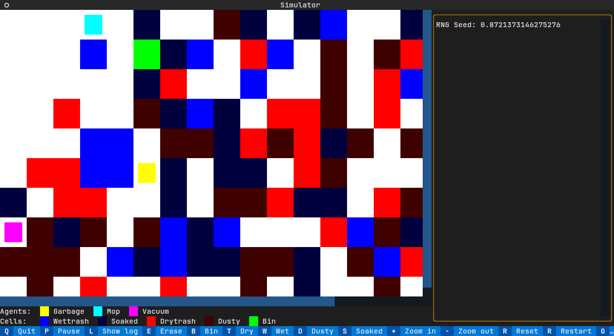

# Multi-agent garbage collection



## Description

This app simulates a grid of garbage to be cleaned up by autonomous agents.
It uses the Textual library to build its UI, so it will work in the vast majority of terminals.

There are four types of garbage:
* Wet trash
* Dry trash
* Dusty ground
* Soaked ground

There are three agents:
* Garbage cleaner: Cleans up wet and dry trash, must return to the bin once its trash capacity is full
* Vacuum: Cleans up dusty squares
* Mop: Cleans up wet squares

When the garbage agent cleans up a wet or dry trash, it leaves behind a dusty or soaked square, respectively.

## Usage

The simulator can be run using `./main.py` after activating the virtual environment.
It runs in your terminal but is designed to be interacted with by a combination of mouse and keyboard.

Important controls (can also be accessed by clicking the associated labels in the footer):
* `p` pauses/resumes the simulation
* `r` restarts the simulation (`Shift+R` also changes the seed for the random number generation)
* `l` shows/hides the logs (the log panel can also be resized by dragging its left edge)
* Selecting "Trash", "Wet", "Dusty", "Soaked", or "Erase" sets the type of garbage you place in a cell when clicking on it with your mouse
* `g`, `m`, or `v` focuses on the garbage to be cleaned up each individual agent

Many more options are available through the command line when starting a new simulation.
For example, to run a simulation on a grid with the individual agent automation code, 10 rows, 15 columns, 5 bins, and 80% of the grid randomly filled at the start, use:

```shell
./main.py -i -x 15 -y 10 -b 5 -f 0.8
```

Or to run 10 tests on a 10x10 grid using a set start seed as fast as possible:

```shell
./main.py -x 10 -y 10 -t 10 -d 0.01
```

The full listing of arguments is:

```
# ./main.py --help
usage: Trash simulator [-h] [-i] [-x COLUMNS] [-y ROWS] [-s SCALE] [-d DELTA] [-e SEED] [-f FILL] [-g GARBAGE] [-b BINS] [-t TESTS] [-r] [-c GARBAGE_CAPACITY]

Simulates agents cleaning trash

options:
  -h, --help            show this help message and exit
  -i, --individual      Whether to use the individually managed agents
  -x COLUMNS, --columns COLUMNS
                        How many columns in the grid
  -y ROWS, --rows ROWS  How many rows in the grid
  -s SCALE, --scale SCALE
                        Scale of the grid display
  -d DELTA, --delta DELTA
                        Time between simulation ticks in seconds
  -e SEED, --seed SEED  RNG seed
  -f FILL, --fill FILL  Proportion of dirty squares [0, 1]
  -g GARBAGE, --garbage GARBAGE
                        Proportion of trash squares out of the dirty squares [0, 1]
  -b BINS, --bins BINS  Number of bins
  -t TESTS, --tests TESTS
                        Number of test simulations to run
  -r, --random-start    Whether to randomise the start position
  -c GARBAGE_CAPACITY, --garbage-capacity GARBAGE_CAPACITY
                        Trash capacity of the garbage agent
```
